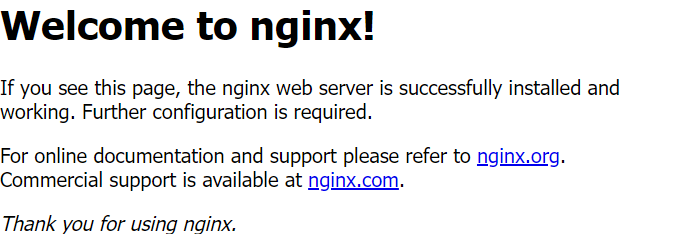

[Install Nginx Webserver](https://bitfexl.github.io/piadmin/nginx)

<br>

# Nginx Webserver

---

> [nginx](https://nginx.org/en/) [engine x] is an HTTP and reverse proxy server, a mail proxy server, and a generic TCP/UDP proxy server

> **Basic HTTP server features**

> -   Serving static and [index](https://nginx.org/en/docs/http/ngx_http_index_module.html) files
> -   [Reverse proxying with caching](https://nginx.org/en/docs/http/ngx_http_proxy_module.html), [load balancing](https://nginx.org/en/docs/http/ngx_http_upstream_module.html)
> -   Filters include [gzipping](https://nginx.org/en/docs/http/ngx_http_gzip_module.html)
> -   [SSL and TLS SNI support](https://nginx.org/en/docs/http/ngx_http_ssl_module.html)

**For short:**
Nginx is a webserver which can serve static files (html files, images, css files, js files, ...) and it can do that via https (as any website should do). It can also act as an [reverse proxy](https://en.wikipedia.org/wiki/Reverse_proxy) distributing requests between different webservers.

<br>

## Install

---

```bash
sudo apt update -y
sudo apt install nginx -y
```

Typing the ip address of the Raspberry into the address bar of your browser should now display something like this:



### Page does not load? Or something different is displayed?

Most likely something is "blocking" the port 80 on your raspberry (an other webserver like [apache](https://httpd.apache.org/) for example).

You can find out what by typing `sudo lsof -i`. Command is the program using this port and PID the process id of the program. End that program by typing `sudo kill PID`. Then nginx can be started with `sudo service nginx start`.

<br>

## Basic commands

---

**Display status:**

```bash
sudo service nginx status
```

**Start:**

```bash
sudo service nginx start
```

**Reload:**

```bash
sudo nginx -s reload
```

**Stop:**

```bash
sudo nginx -s stop
```

<br>

## Custom html

---

Static files are located in `/var/www/html`. Any resource located in that directory will be served under that url.

By default only _root_ can write in that directory. To make the user _pi_ the owner type:

```bash
sudo chown pi /var/www/html
sudo chown pi /var/www/html/*
```

Now the user pi can write files to that directory.

Test _index.html_ page:

```bash
echo "Hello World!" > /var/www/html/index.html
```
